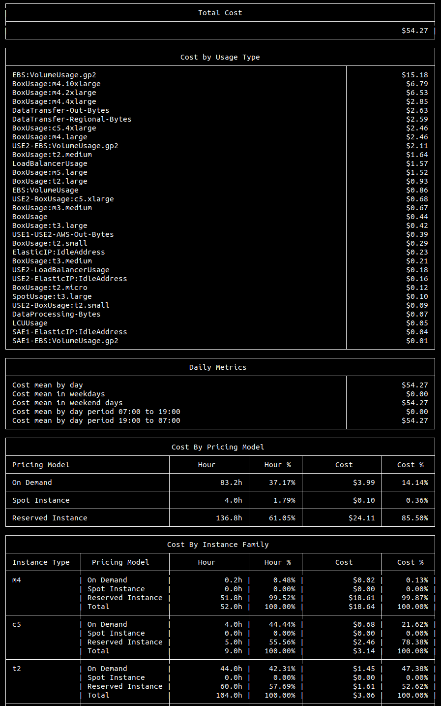
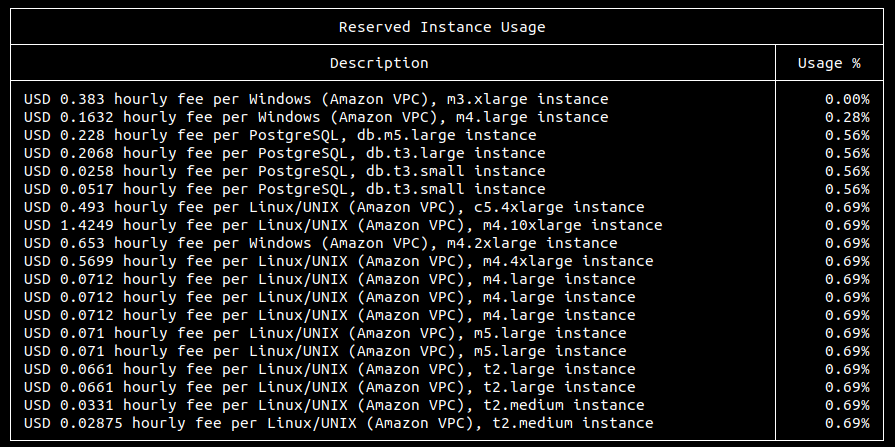

# AWS Cost Miner
> Application to extract useful information from AWS Billing Report

## Goal

Understanding all the costs we have when using Amazon Web Services is not a simple task.

The goal of this project is to provide useful and organized data on the costs of your infrastructure, thus facilitating resource optimization.

## Mining Data

AWS provides a report in CSV format of all your detailed costs. This report is in a bucket of your S3. More details on how to get it [click here](https://docs.aws.amazon.com/awsaccountbilling/latest/aboutv2/DetailedBillingReport.html).

With this file in hand, simply execute one of the docker commands below, as needed.

## Reports

This tool provides a few different types of report. The data is presented in the console itself, but there are plans for new reports to be built in new formats.

Replace *$(pwd)/data.csv* with *$(pwd)/YOUR_FILE_NAME.csv* to run the command.

### EC2 COST REPORT

This report presents the detailed costs of your EC2-related products such as instances and disks.


 
```
docker run --rm \
    --name aws-cost-miner \
    -v $(pwd)/data.csv:/app/data.csv \
    -e report=EC2_COST_REPORT \
    -e groupBy="user:Name" \
    robsonbittencourt/aws-cost-miner
```

You can group the data according to one of the columns of the CSV file. Use the column name as it is in the file. Your tags can be used just like the example below.

```
docker run --rm \
    --name aws-cost-miner \
    -v $(pwd)/data.csv:/app/data.csv \
    -e report=EC2_COST_REPORT \
    -e groupBy="user:Name" \
    robsonbittencourt/aws-cost-miner
```

### RESERVED INSTANCE USAGE REPORT

This report demonstrates the usage percentages for all of your [Reserved Instances](https://docs.aws.amazon.com/AWSEC2/latest/UserGuide/ec2-reserved-instances.html).



```
docker run --rm \
    --name aws-cost-miner \
    -v $(pwd)/data.csv:/app/data.csv \
    -e report=RESERVED_INSTANCE_USAGE_REPORT \
    robsonbittencourt/aws-cost-miner
```

